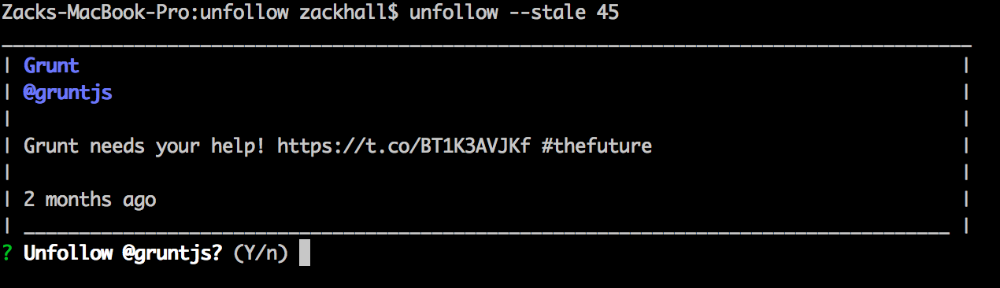

The npm unfollow tool is a tool you can run from the CLI to help you programatically identify and unfollow accounts that have been active over a certain length of time.

Example:

`unfollow --stale 120`

This command will find all accounts that you follow who have created no new content in 120 days and prompt you to unfollow them. In addition, it'll show you their last tweet to help you decide.

## Why

I found that there was a large disconnect between the number of accounts that I was following, and the number of accounts whose content I saw weekly. I was following over 700 accounts, so there wasn't a good way to go through and review the accounts that weren't producing content.

So I wrote a tool that allowed me to filter accounts who haven't tweeted in a set amount of days, and make a decision if I'd like to unfollow them or not.

## Getting started

You will need valid Twitter developer credentials in the form of a set of consumer and access tokens/keys. You can get these by creating a new app [here](https://apps.twitter.com/).

You must set the following environment variables from the app created in the previous step:

- TWT_CONSUMER_KEY
- TWT_CONSUMER_SECRET
- TWT_ACCESS_TOKEN,
- TWT_ACCESS_TOKEN_SECRET

Now, install the package:

`npm install -g unfollow`

If you'd like to review the source code or contribute to the project, it's available on [github.com/zackhall/unfollow](https://github.com/zackhall/unfollow/).

## Interesting observations

One interesting thing that I noticed with this tool is that most of the personal accounts that I'd followed, e.g. friends from high school, college, and Seattle, went inactive between 7 months to 1 year ago. Whereas, most of the accounts I follow in interest to my work and career (mostly JavaScript devs and accounts) have been very active.

A sample size of one is not enough to draw conclusions on, but it certainly seems to indicate a lack of interest in using Twitter for personal accounts in my demographic.
