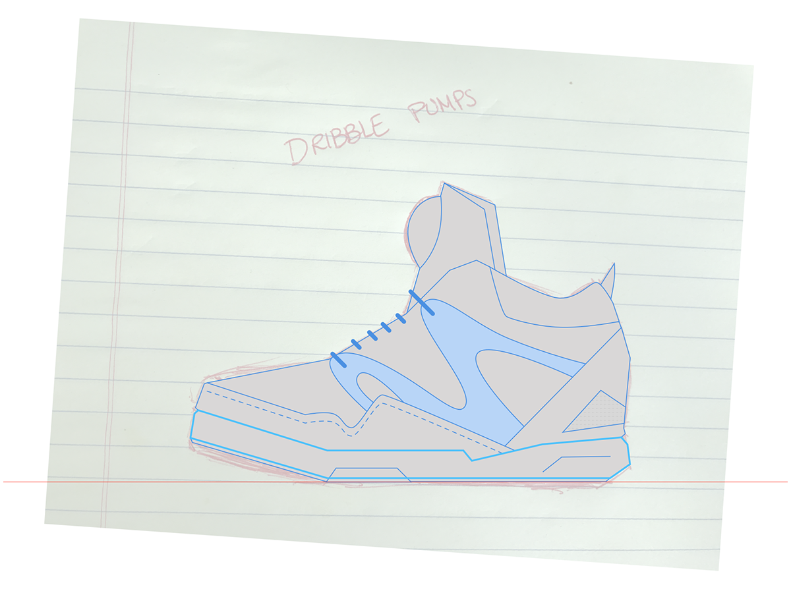
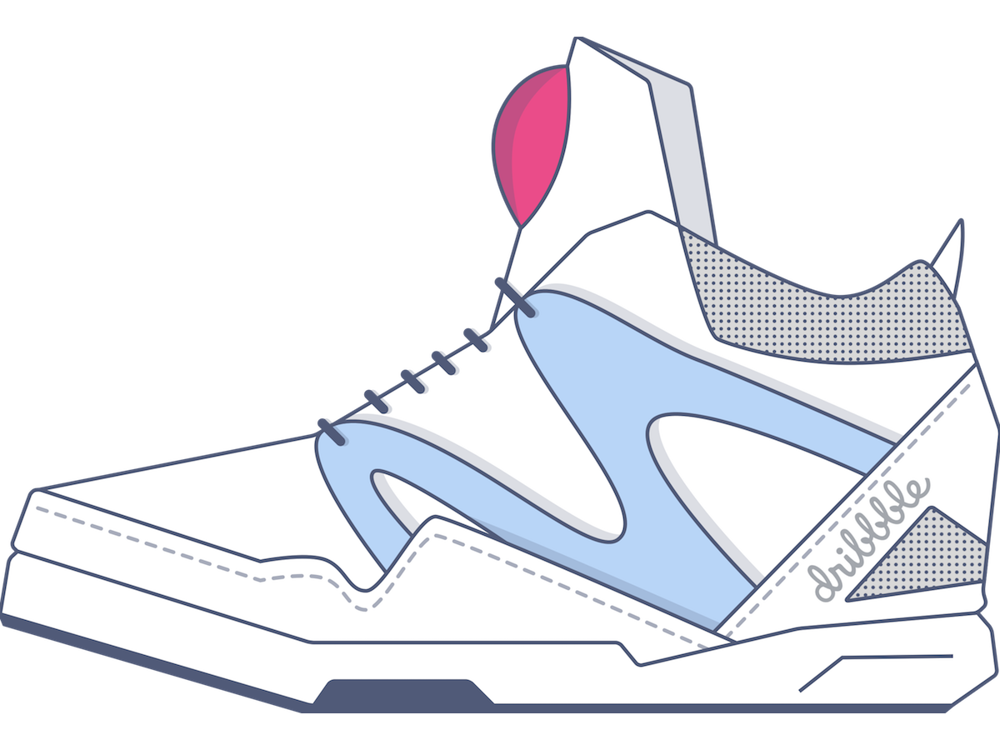

I wanted a big challenge to practice my vector illustration skills. Looking around for something to work on I glanced down at my feet and found the perfect challenge. I'll illustrate my favorite pair of kicks – my Reebok Pumps. Shoes present the perfect opportunity: complex shapes to practice pen tool skills, shading, textures.

Below are some shots from the progression to the final shot.

  

    
    

      The original shoes used for an inspiration.
    

  

  

    
    

      Initial sketches to use as the basis of the illustration.
    

  

  

    
    

      Laying out the initial lines.
    

  

  

    
    

      A happy resizing accident provided a template for a interesting and responsive version of the iconography.
    

  

  

    
    

      Final drawing of the kicks, all that's left now are the final touches for presentation.
    

  

  

    
    

      The final Reebok Pumps vector illustration – with details, a horizon, and a background spotlight for presentation.
    

  

